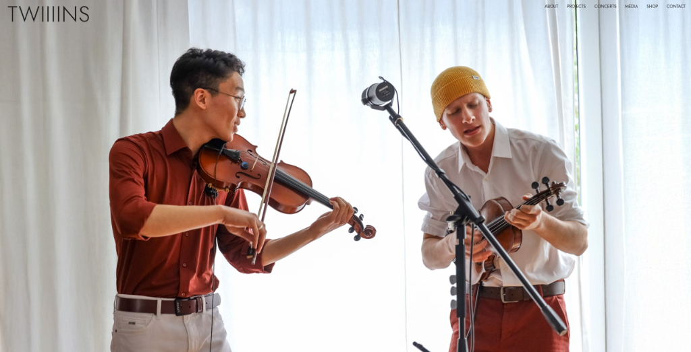
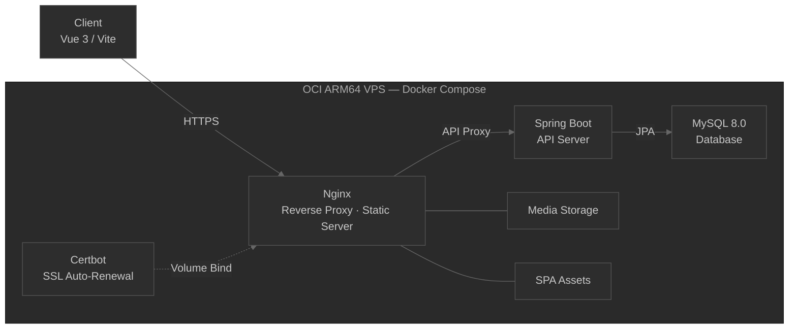

# TWIIIINS Official Website

> 현대 음악 및 퍼포먼스 듀오 TWIIIINS의 공식 웹사이트.
> 공연 정보·프로젝트 아카이빙·미디어를 실시간으로 제공하고, 비개발자 멤버도 쉽게 편집할 수 있는 자체 어드민 시스템을 구축하여 현재까지 운영 중인 서비스입니다.

**[실제 서비스 바로가기 →](https://twiiiins.com)**

`2025.12 ~ 현재 운영 중`

---

## 프로젝트 개요

| | |
|---|---|
| **기간** | 2025.12 ~ 현재 (7개월째 운영 중) |
| **역할** | 개발 / 배포 / 운영 전체 담당 (1인 개발) |
| **목적** | 듀오 아티스트의 웹사이트 구축 및 비개발자 멤버도 직접 콘텐츠를 관리할 수 있는 시스템 마련 |

**만든 이유**

- **아티스트 브랜딩 및 아카이빙** — 매년 진행되는 현대 음악 공연과 예술 프로젝트를 기록하고 알리기 위해 시작
- **운영 효율화** — 비개발자 멤버도 코드 수정 없이 공연 일정·장비 목록·프로필 파일을 직접 업데이트할 수 있는 CMS 탑재
- **지속성** — 실사용자 피드백을 반영하며 기능을 추가·개선해 라이브 서비스를 유지 운영

---

## 핵심 기능

### 1. 반응형 공연·프로젝트 아카이브
- 모바일/PC 환경 모두에 최적화된 공연 및 프로젝트 목록 제공
- 이미지 갤러리 및 메타데이터(일시, 장소, 프로그램 등) 구조적 노출

### 2. 관리자 어드민 대시보드 (자체 CMS)
- 코드 수정 없이 콘서트 등록/수정/삭제, 파일 업로드, 장비 관리 가능한 CRUD 제어판
- Spring Security + JWT 기반 세션 처리로 관리자 전용 접근 제어

### 3. 미디어·리소스 다운로드 파이프라인
- 기획사·프레스 대상 고화질 프로필 이미지 및 테크니컬 라이더(PDF) 다운로드 지원
- 원본 디렉토리 직접 접근 통제, WebP 변환 및 압축 경로 분리 서빙

---

## 시스템 아키텍처

**배포 파이프라인**

```mermaid
%%{init: {"theme": "base", "themeVariables": {"primaryColor": "#2d2d2d", "primaryTextColor": "#c8c8c8", "primaryBorderColor": "#444444", "lineColor": "#666666", "secondaryColor": "#383838", "background": "#1e1e1e", "nodeBorder": "#555555", "clusterBkg": "#2a2a2a", "edgeLabelBackground": "#2d2d2d", "fontFamily": "monospace"}}}%%
flowchart LR
    A["git push"] --> B["GitHub Actions"]
    B --> C["Node / Gradle Build"]
    C --> D["Docker ARM64 Image Build"]
    D --> E["GHCR Push"]
    E --> F["SSH to OCI Server"]
    F --> G["Docker Compose\nRolling Reload"]
    G --> H["Zero-Downtime\nDeploy Complete"]
```

> **SSL 갱신**: Certbot 컨테이너와 Nginx 간 볼륨 바인딩으로 Let's Encrypt 인증서 12시간마다 자동 체크·갱신

---

## 기술 스택

| 영역 | 기술 | 선택 이유 |
|---|---|---|
| **Frontend** | Vue 3, Vite, Pinia, Vue Router | 번들 사이즈가 작고 초동 로딩이 빠름, 상태 관리가 간결 |
| **Backend** | Spring Boot 3, Java 17 | 비즈니스 로직 안정성 확보, JPA 기반 ORM 활용 |
| **Database** | MySQL 8.0 | 공연·장비 등 정형 데이터 관리 |
| **Web Server** | Nginx | 정적 파일·미디어 서빙, 백엔드 리버스 프록시 |
| **DevOps** | Docker Compose, OCI VPS, GitHub Actions | 저비용 ARM 인프라, 환경 일치화, 무중단 자동 배포 |

---

## 운영하며 겪은 이슈

### 이슈 1 — AWS EC2에서 Docker 이미지 직접 빌드 시 서버 자원 고갈

**현상** 배포 스크립트 실행 중 EC2 인스턴스에서 `Killed` 또는 디스크 용량 초과로 빌드 프로세스가 강제 종료, 배포 실패 반복

**원인** 프리티어 EC2는 메모리·저장공간이 협소한데,  
Spring Boot + Vue를 서버에서 직접 빌드하면 Gradle/Node 컴파일 과정에서  
메모리를 모두 소모하거나, 중간 레이어·로그·캐시가 쌓여 디스크를 꽉 채워버림

**해결** 빌드를 서버에서 분리 — GitHub Actions Runner에서 Node/Gradle 빌드 후  
Docker 이미지를 생성하여 GHCR(GitHub Container Registry)에 Push,  
배포 서버는 SSH로 접속 후 `docker pull` + `docker compose up`만 실행하도록 전환

**결과** EC2 서버는 빌드 부담 없이 컨테이너 실행만 담당,  
이후 OCI ARM64로 마이그레이션 시에도 동일한 파이프라인 구조 그대로 활용

---

### 이슈 2 — 고화질 원본 이미지 서빙으로 인한 로딩 성능 저하

**현상** 모바일 환경에서 갤러리 탭 진입 시 화면 로딩 눈에 띄게 지연·버벅거림

**원인** 수십 MB 고화질 원본 카메라 사진이 그대로 웹에 노출 → 대역폭 과부하

**해결** 이미지 업로드 시 다중 해상도 리사이징 파이프라인(`create-image-variants.ps1`) 구성  
WebP 변환 + 디바이스 너비별 이미지 서빙  
Nginx 캐싱 헤더(`Cache-Control: public, immutable`) 적용

**결과** 모바일 로딩 용량 최대 80% 절감, Lighthouse LCP 성능 개선

---

### 이슈 3 — Docker 볼륨 생성 디렉터리의 root 소유권으로 배포 스크립트 권한 오류

**현상** 배포 중 `chmod 777 ./uploads` 명령이 `Operation not permitted` 오류로 실패,  
컨테이너 재시작 후 파일 업로드 기능 전체 불능 상태 발생

**원인** `/uploads` 디렉터리가 최초 `docker compose up` 실행 시 Docker 데몬(root)이 생성 →  
SSH 접속 배포 유저에게는 해당 디렉터리의 소유권이 없어 `chmod` 명령 실패  
로컬·개발 환경에서는 디렉터리를 직접 생성하므로 재현 자체가 불가능한 문제

**해결** `chmod` 실패 시 Alpine 경량 컨테이너를 임시 실행하여 볼륨을 마운트,  
컨테이너 내부(root 권한)에서 소유권을 변경하는 fallback 처리를 배포 스크립트에 추가

**결과** 소유권 문제와 무관하게 배포 환경에서 안정적으로 권한 설정 완료

---

## 변경 이력

| 버전 | 시기 | 주요 변경 내용 |
|---|---|---|
| **v1.0** | 2025.12 | 최초 공식 런칭 — 공연 아카이브, 어드민 CRUD, S3 업로드, Nginx SPA 라우팅 구축 |
| **v1.1** | 2026.01–02 | 모바일 반응형 최적화, GitHub Actions + GHCR 배포 전환, Certbot SSL 자동 갱신 |
| **v2.0** | 2026.05 | AWS S3 제거 → 로컬 스토리지 통일, 이미지 최적화 파이프라인, Nginx alias 서빙 도입 |
| **v2.1** | 2026.07 | 해상도별 이미지 다중 생성, SPA 404 이슈 해결, ARM64 빌드·무중단 배포 자동화 |

---

## 모니터링 / 운영 체계

- **에러 모니터링** — Spring Boot Actuator + Docker log rotation(`max-size: 10m`)으로 상태 추적 및 트러블슈팅
- **성능 측정** — Lighthouse Core Web Vitals 정기 측정 및 이미지 최적화율 검증

---

## 회고 및 다음 계획

**운영하면서 배운 점**

로컬에서는 나타나지 않던 ARM64/x86_64 아키텍처 불일치, 대용량 이미지 트래픽 문제 등을 실서버에서 직접 겪으면서 성능 튜닝과 인프라 자동화의 중요성을 알게 됐습니다.

local → AWS → OCI 마이그레이션을 반복하면서 리팩토링과 꾸준한 유지보수의 필요성도 느꼈습니다.

**다음 업데이트 계획**

| 기능 | 내용 |
|---|---|
| 음원 스트리밍 위젯 | 대표 음원을 웹에서 바로 들을 수 있는 플레이어 위젯 연동 |
| 공연 예매 API 연동 | 티켓 예매 플랫폼 API 연동으로 예매 링크 직접 제공 |
| 굿즈 판매 기능 | 굿즈 판매 기능 추가 |