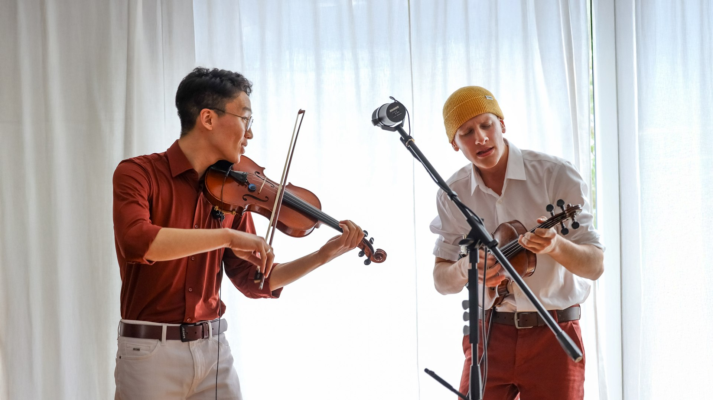

# TWIIIINS Official Website

> 🎵 현대 음악 및 퍼포먼스 듀오 TWIIIINS의 공식 웹사이트로, 공연 정보·프로젝트 아카이빙·미디어를 실시간으로 제공하고 비개발자 멤버도 쉽게 편집할 수 있도록 자체 어드민 시스템을 구축하여 현재까지 지속적으로 운영 중인 서비스입니다.

🔗 **[실제 서비스 바로가기](https://twiiiins.com)**



**🟢 배포일 2025.03 ~ 현재까지 운영 중**

---

## 📌 프로젝트 개요

- **기간**: 2025.03 출시 ~ 현재 (16개월째 운영 중)
- **역할**: 기획 / 디자인 / 개발 / 배포 / 운영 전체 담당 (1인 개발)
- **목적**: 듀오 아티스트의 고유한 예술적 색깔을 살린 브랜드 웹사이트 구축 및 지속 가능한 콘텐츠 업데이트 시스템 마련

**왜 만들었고, 왜 계속 운영하고 있는지**
- **아티스트 브랜딩 및 아카이빙**: 매해 진행되는 독창적인 현대 음악 공연과 예술 프로젝트를 체계적으로 기록하고 알리기 위해 시작했습니다.
- **실사용 및 운영 효율성**: 비개발자 멤버도 별도의 코드 수정 없이 웹 브라우저를 통해 실시간으로 공연 일정, 장비 목록, 프로필 파일(PDF 등)을 업데이트할 수 있는 직관적인 CMS(콘텐츠 관리자 UI)를 탑재하여 실제 운영 리소스를 대폭 줄였습니다.
- **지속성**: 실사용자 피드백을 수용하며 최적화와 새로운 기능을 덧붙여 실제 라이브 서비스를 안정적으로 가동하고 있습니다.

---

## 🎬 핵심 기능 & 화면

### 1. 반응형 공연 및 프로젝트 아카이브
- 듀오의 독자적인 프로젝트와 공연(Concerts) 목록을 모바일/PC 환경 모두에 최적화하여 제공합니다.
- 이미지 갤러리 및 상세 메타데이터(일시, 장소, 프로그램 내용 등)가 구조적으로 노출됩니다.

### 2. 관리자 전용 어드민 대시보드 (자체 CMS)
- 코드 수정 없이 콘서트 등록/수정/삭제, 파일 업로드, 장비 세팅 관리가 가능한 CRUD 제어판을 제공합니다.
- 관리자 권한을 가진 멤버만 접근할 수 있도록 Spring Security와 JWT 기반 세션 처리가 되어 있습니다.

### 3. 미디어 및 리소스 다운로드 파이프라인
- 공연 기획사 및 프레스를 위한 공식 고화질 프로필 이미지와 테크니컬 라이더(PDF)를 다운로드할 수 있는 전용 파일 서빙 아키텍처를 지원합니다.
- 원본 이미지 보안을 위해 원본 디렉토리 직접 접근은 통제하며, 압축 및 WebP 변환을 적용한 서빙 경로를 분리하였습니다.

---

## 🏗 시스템 아키텍처

```
Client (Vue 3 / Vite)
   │
   ▼ (HTTPS / Nginx Port Routing)
OCI ARM64 VPS Container Stack (Docker Compose)
   ├── Nginx (Reverse Proxy & Static Web Server)
   │     ├── SPA Web Assets Serve (frontend/dist)
   │     └── Uploaded Media Content (/uploads)
   ├── Spring Boot (API Server - port: 8080)
   ├── MySQL 8.0 (Database - port: 3306)
   └── Certbot (SSL Automated Renewal)
```

- **배포 방식**: GitHub Push ➔ GitHub Actions 워크플로우 작동 ➔ Node/Gradle 빌드 및 Docker ARM64 이미지 빌드/GHCR 푸시 ➔ Target 서버 SSH 원격 스크립트 실행 및 Docker Compose 컨테이너 롤링 재배포 (Zero-Downtime Reload)
- **도메인/SSL 관리 방식**: Certbot 도커 컨테이너와 Nginx 웹 서버 간 볼륨 바인딩을 통해 Let's Encrypt SSL 인증서를 12시간마다 자동 체크 및 갱신 데몬 운영

---

## 🛠 기술 스택 & 선택 이유

| 영역 | 기술 | 선택 이유 |
|---|---|---|
| **Frontend** | Vue 3, Vite, Pinia, Vue Router | 콤팩트한 번들 사이즈로 빠른 페이지 초동 로딩 속도 확보, 간결한 상태 관리 |
| **Backend** | Spring Boot 3, Java 17 | 다중 기기/관리자 비즈니스 로직 처리의 안정성 확보 및 JPA를 활용한 강력한 ORM 구축 |
| **Database** | MySQL 8.0 | 프로젝트와 공연 메타데이터, 장비 정보 등의 정형 데이터를 안전하게 보관 및 관리 |
| **Proxy & Web Server** | Nginx | Vue 빌드 정적 파일과 업로드된 미디어 리소스(이미지/PDF)의 초고속 다이렉트 서빙 및 백엔드 포트 프록시 처리 |
| **Infrastructure / DevOps** | Docker & Compose, OCI VPS, GitHub Actions | ARM 기반 저비용 고성능 인프라 최적화, 개발 및 서버 환경 일치화, 푸시 한 번으로 무중단 배포가 가능한 완전 자동화 파이프라인 구현 |

---

## 🔧 운영하며 겪은 이슈

### 이슈 1. OCI ARM64 VPS 환경 배포 시 백엔드 이미지 실행 오류 (Exec format error)
- **발견 경위**: GitHub Actions를 통한 자동 배포 완료 후, OCI 인스턴스에서 백엔드 컨테이너가 가동되지 않고 즉시 크래시되는 현상 확인.
- **원인**: GitHub Actions의 기본 러너(ubuntu-latest)는 x86_64 아키텍처 기반이어서 x86_64 컴파일된 도커 이미지가 생성되었으나, 실 배포 서버는 Oracle Cloud의 ARM64 아키텍처 인스턴스여서 아키텍처 불일치로 실행 불가능했음.
- **해결**: `.github/workflows/deploy.yml` 파일 내에 `setup-qemu-action` 및 `setup-buildx-action` 단계를 추가하고, `docker/build-push-action`에서 `platforms: linux/arm64` 멀티 플랫폼 빌드 옵션을 명시하여 ARM64 타겟용 이미지를 크로스 컴파일하도록 수정함.
- **결과**: ARM 호환 도커 이미지가 정상 생성되어 배포 서버에서 안정적으로 서비스 가동 완료.

### 이슈 2. 고화질 이미지 서빙에 따른 트래픽 낭비 및 초기 로딩 성능 저하
- **발견 경위**: 모바일 데이터 환경에서 아티스트 갤러리 탭 진입 시 화면 로딩이 눈에 띄게 지연되고 버벅거리는 문제 접수.
- **원인**: 아티스트가 어드민을 통해 업로드한 수십 MB 용량의 고화질 원본 카메라 사진이 그대로 웹 사이트에 노출되면서 대역폭 과다 차지 및 메모리 과부하 발생.
- **해결**: 백엔드 업로드 라이프사이클 및 외부 유틸리티에 이미지 다중 해상도 리사이징 파이프라인(`create-image-variants.ps1` 및 스크립트)을 구성하여 WebP 포맷 변환 및 디바이스 너비별 최적화 이미지를 제공하고, Nginx 캐싱 헤더(`Cache-Control "public, immutable"`)를 부여함.
- **결과**: 모바일 화면 로딩 용량을 최대 80% 이상 절감하여 Lighthouse LCP 성능 및 모바일 체감 로딩 속도 대폭 개선.

### 이슈 3. SPA 라우팅 후 페이지 새로고침 시 404 Not Found 발생
- **발견 경위**: 사용자가 웹페이지 내에서 `/projects` 또는 `/concerts` 메뉴로 진입한 후 브라우저 새로고침을 누르면 Nginx 404 에러 페이지가 노출되는 문제 발견.
- **원인**: Vue는 단일 페이지 애플리케이션(SPA)으로 실제 서버에는 `index.html` 파일만 존재하지만, Nginx는 브라우저가 요청한 `/projects` 등의 경로에 대응되는 물리 파일/디렉토리를 호스트 시스템에서 찾으려 했기 때문.
- **해결**: Nginx 설정(`nginx.conf`)의 root server block 내 `location /` 항목에 `try_files $uri /index.html;` 구문을 추가하여 존재하는 정적 파일이 없을 경우 무조건 `index.html`로 요청을 포워딩해 Vue Router가 경로를 해석하게 만듦.
- **결과**: 어떠한 서브 경로에서도 새로고침 및 직접 주소 입력 시 오류 없이 올바르게 화면이 로드됨.

---

## 🔄 변경 이력

| 버전 | 시기 | 변경 내용 |
|---|---|---|
| **v1.0** | 2025.03 | 최초 공식 런칭 및 운영 개시 (공연 정보, 프로젝트 아카이브, 어드민 제공) |
| **v1.1** | 2025.06 | 반응형 레이아웃 세부 개선 및 프로젝트 이미지 그리드 갤러리 고도화 |
| **v2.0** | 2025.11 | 아티스트 브랜드 개편에 따른 UI/UX 리뉴얼 및 썸네일 변환 자동화 도입 |

---

## 📊 모니터링 / 운영 체계

- **에러 및 상태 관리**: Spring Boot Actuator 연동 및 Docker log rotation(max-size: 10m 설정)을 도입하여 예기치 못한 어플리케이션 상태 모니터링 및 트러블슈팅 용이성 확보
- **성능 관리**: Lighthouse를 통한 Core Web Vitals 정기 측정 및 이미지 최적화율 검증

---

## 💭 회고 및 다음 계획

**운영하면서 배운 점**
- 로컬이나 개발 환경에서는 발견하기 힘든 아키텍처 불일치(ARM64 vs x86_64)나 대용량 고화질 이미지 업로드로 인한 트래픽 지연 등을 겪으면서, 실서버 환경과 모바일 유저 사용성에 초점을 맞춘 성능 튜닝 및 인프라 자동화의 중요성을 깊이 체감했습니다.

**다음 업데이트 계획**
- **글로벌 다국어 지원**: 다국적 기획사/유저를 위해 한국어와 영어의 정교한 로컬라이제이션 위젯 제공
- **음원 스트리밍 위젯**: 대표 음원을 웹 브라우저 내에서 즉각 감상할 수 있는 플레이어 위젯 연동
- **공연 예매 API 연동**: 티켓 예매 대행 플랫폼 API 연동을 통한 실시간 티켓 예매 링크 활성화

---

<details>
<summary>📦 로컬 개발 환경 설정 (접어두기)</summary>

### 1. 레포지토리 클론
```bash
git clone https://github.com/choichanwoo001/Twiiiins.git
cd Twiiiins
```

### 2. Frontend 실행 (Vue 3 / Vite)
```bash
cd frontend
npm install
npm run dev
```
- Local URL: http://localhost:5173

### 3. Backend 실행 (Spring Boot / Java 17)
- 로컬 DB(MySQL)가 실행 중이거나 백엔드 설정 환경변수가 알맞게 설정되어 있어야 합니다.
```bash
cd backend
./gradlew bootRun
```
- API Base: http://localhost:8080

### 4. Docker Compose 활용 로컬 실행
```bash
# 루트 디렉토리에서 실행
docker compose up -d --build
```

</details>
